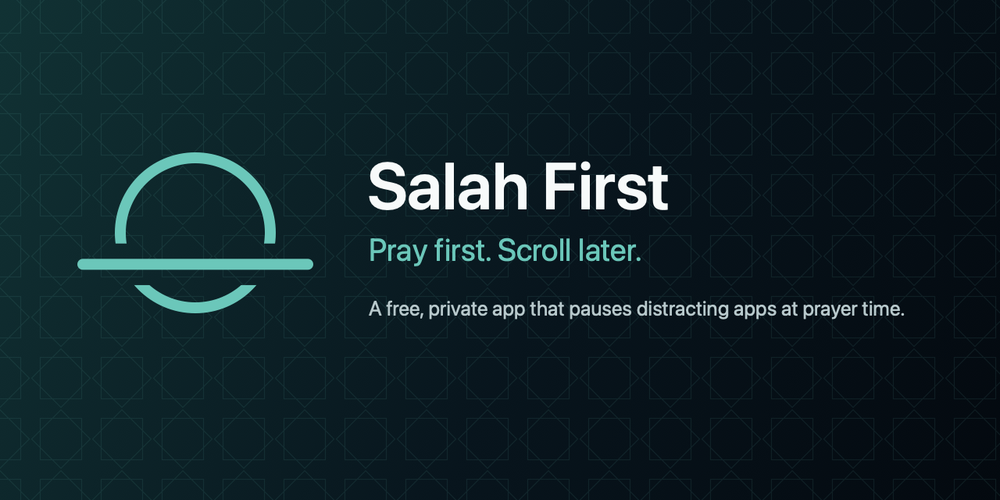
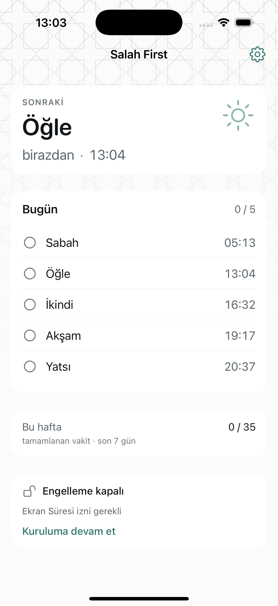
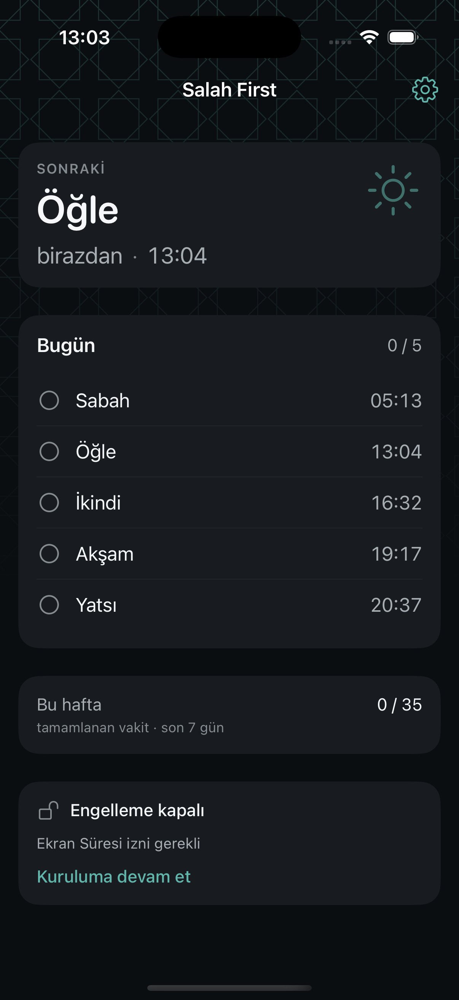
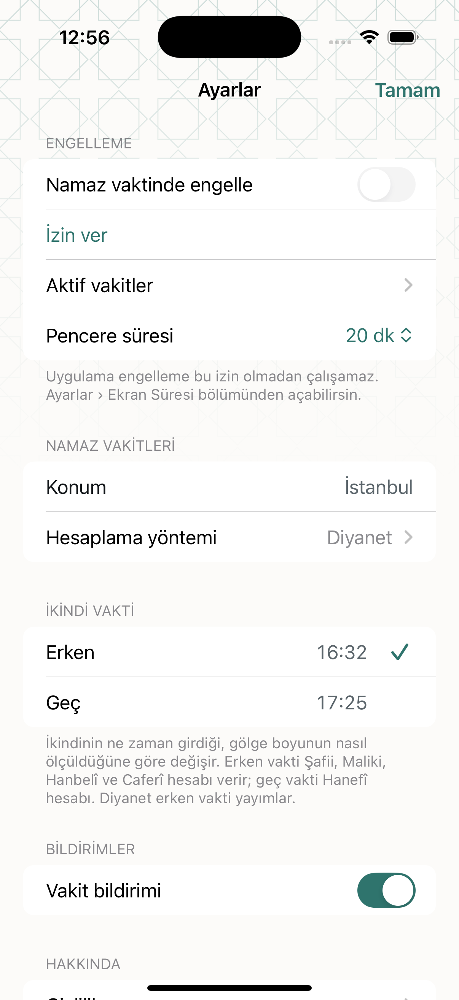

<p align="center">
  
</p>

<p align="center">
  
  
  
  
  
</p>

# Salah First

Salah First pauses the apps that pull you in when it is time to pray. You pick
the apps. When a prayer time arrives, they lock. When you tap *I have prayed*,
they unlock.

It is a commitment device, not a supervisor. It does not try to verify that you
prayed, and it never traps you on your own phone.

- Free. No ads, no subscription, no in-app purchases, no donations.
- No account, no server, no analytics, no trackers, no third-party SDKs.
- Prayer times are calculated on the device. The app works in airplane mode.
- iOS 17+, iPhone only. Turkish and English.

<p align="center">
  
  
  
</p>

---

## How it works

Blocking is done by Apple's Screen Time frameworks, through three app
extensions that the system runs on our behalf:

| Target | Extension point | Job |
|---|---|---|
| `SalahFirst` | — | UI, prayer-time calculation, scheduling |
| `SalahFirstMonitor` | `com.apple.deviceactivity.monitor-extension` | Raises and lifts the shield at window boundaries |
| `SalahFirstShieldConfiguration` | `com.apple.ManagedSettingsUI.shield-configuration-service` | Draws the screen shown in place of a blocked app |
| `SalahFirstShieldAction` | `com.apple.ManagedSettings.shield-action-service` | Handles the buttons on that screen |

The four targets share state through an App Group, as JSON files written under
`NSFileCoordinator`.

### Why extensions rather than the app itself

The app is usually not running when a prayer time arrives. `DeviceActivity`
registrations live in the system and survive app termination and reboot, so the
monitor extension is woken by iOS at the exact moment a window opens. That is
what makes blocking reliable rather than best-effort.

### Scheduling

Prayer times move by a few minutes every day, so a repeating
`DeviceActivitySchedule` — which carries only an hour and a minute — would drift
away from the real times within a week. Salah First instead registers
**non-repeating schedules pinned to specific dates** and keeps a rolling horizon.

Two of Apple's limits shape this design:

- **At most 20 monitored activities** per app *including its extensions*. We arm
  15 and leave the rest as headroom.
- **No interval shorter than 15 minutes** (`MonitoringError.intervalTooShort`).
  The window length is clamped to this floor.

Because only 15 windows can be armed but the monitor extension cannot compute
prayer times itself — it has neither a location nor the memory budget — the app
writes **14 days** of windows to a shared cache. The extension re-arms from that
cache as windows are consumed.

Four independent layers keep the schedule alive, so no single one is a point of
failure:

1. The monitor extension re-arms whenever a window closes.
2. Bringing the app to the foreground rebuilds everything.
3. A prayer notification brings the user back into the app.
4. A daily `BGAppRefreshTask`, when iOS grants one.

### Prayer times

Calculated with [adhan-swift](https://github.com/batoulapps/adhan-swift) (MIT),
entirely offline. Twelve calculation methods are offered; the default is chosen
from the device region, so a Turkish device starts on Diyanet's method. Asr can
be set to the standard (Shafi) or Hanafi shadow length.

---

## Privacy

There is no backend. There is nothing to opt out of.

- **No account.** No email address, phone number, or sign-in.
- **No network.** The app contains no network client. It has never made a
  request and cannot.
- **Location** is used only to calculate prayer times, only on the device.
  There is deliberately no reverse geocoding — resolving a coordinate to a city
  name would send that coordinate to a third party. Users who want a named place
  pick from a bundled list of 200 cities instead. Stored coordinates are rounded
  to three decimal places (~100 m).
- **App selection** happens inside Apple's `FamilyActivityPicker`, which runs
  out of process. Salah First receives opaque tokens and never learns which apps
  are installed or which were chosen.
- **History** is a list of completed prayers, kept on device for at most 120
  days, deletable at any time from Settings.

`Support/App/PrivacyInfo.xcprivacy` declares no tracking, no collected data, and
one required-reason API (`UserDefaults`, reasons `CA92.1` and `1C8F.1`).

---

## Development setup

**Requirements:** Xcode 16.4+, iOS 17 SDK, [XcodeGen](https://github.com/yonaskolb/XcodeGen),
and a paid Apple Developer account (Family Controls is not available to free
accounts).

```bash
brew install xcodegen
git clone <this repo> && cd SalahFirst
xcodegen generate
open SalahFirst.xcodeproj
```

The `.xcodeproj` is generated from `project.yml` and is **not** committed. Run
`xcodegen generate` after pulling changes or adding files.

### Set your Team ID

`Local.yml` is committed empty so that nobody's Team ID ends up in the
repository. Put yours in, then tell git to ignore your edit:

```bash
# Local.yml
settings:
  base:
    DEVELOPMENT_TEAM: "ABCDE12345"
```

```bash
git update-index --skip-worktree Local.yml
```

### Change the identifiers

Bundle IDs and the App Group are declared once, at the top of `project.yml`:

```yaml
settings:
  base:
    APP_BUNDLE_ID: com.salahfirst.app
    APP_GROUP_ID: group.com.salahfirst.app
```

They are substituted into every Info.plist and `.entitlements` file, and read
back at runtime from `SFAppGroupIdentifier`. No Swift changes are needed.

### Build and test

```bash
xcodebuild -project SalahFirst.xcodeproj -scheme SalahFirst \
  -destination 'platform=iOS Simulator,name=iPhone 16 Pro,OS=18.6' test
```

An older simulator runtime is deliberate: the deployment target is iOS 17 and
the tests are pure logic, so there is nothing to gain from booting a current
runtime — and a great deal of time to lose on modest hardware. Building against
the current SDK is a separate matter, and is what App Store submission requires.

**Screen Time APIs do not work in the Simulator.** Authorization always fails
there, so nothing is ever blocked. The rest of the app runs normally and says so
on the permission screen. Blocking must be tested on a real device.

---

## Apple setup

See [`Docs/APPLE_SETUP.md`](Docs/APPLE_SETUP.md) for the full checklist. The
short version:

1. Add the **Family Controls** capability to all four targets (already declared
   in the `.entitlements` files).
2. Create the App Group and add it to all four targets.
3. **Request the Family Controls (Distribution) entitlement from Apple.** This
   is a manual review with no published turnaround time, and TestFlight and App
   Store builds are blocked until it is granted. Start it early.

---

## Adding a language

1. Create `Resources/<code>.lproj/Localizable.strings` and `InfoPlist.strings`.
2. Copy the English files and translate the values.
3. Add the code to `CFBundleLocalizations` in `Support/App/Info.plist` and in
   each extension's `Info.plist`.

No Swift changes are required — every user-facing string goes through `L10n`.
Turkish and English currently ship with full key parity.

---

## Project layout

```
Sources/
  Shared/       Compiled into the app and all three extensions. Foundation and
                ManagedSettings only — kept small for the monitor's memory budget.
  SharedUI/     UIKit palette for the shield extensions.
  Core/         App-only: prayer times, services, design system.
  Features/     SwiftUI screens.
  App/          Entry point and the coordinating model.
Extensions/     The three extension principal classes.
Support/        Info.plist, entitlements, privacy manifest.
Resources/      Assets and localizations.
Tests/          51 unit tests, including a WCAG AA contrast check on the palette.
```

## Design

The one piece of ornament is a *khatim* tessellation — the eight-pointed star
formed by a square and the same square turned 45° — drawn as a very low-contrast
field behind the top of each screen. It is drawn with `Canvas` rather than
shipped as an image, so it stays crisp at any size and adapts to light and dark
on its own.

Geometry is the oldest and most restrained part of Islamic visual tradition,
which lets the app read as what it is without the mosque-clipart look that dates
so many religious apps. Everything else is system typography, a four-point
spacing scale, and a palette held to WCAG AA by a test.

## Contributing

Issues and pull requests are welcome. Two things worth knowing:

- Run `xcodegen generate` after adding or removing files; the `.xcodeproj` is
  generated and not committed.
- Blocking cannot be tested in the Simulator. Anything touching FamilyControls,
  DeviceActivity or ManagedSettings needs a real device and a paid Apple
  Developer account.

## Licence

MIT. See [LICENSE](LICENSE).
